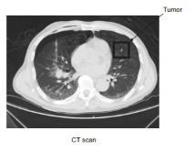

# Lung-Cancer-ct-scan-Classification:
The objective of this project is to create a model that classify the image of a CT-scan of chest cancer. I used the most suitable neural networks and transfer learning to classify among four classes, namely Adenocarcinoma, Large cell carcinoma, Squamous cell carcinoma, and Normal.
# Lung cancer is a growing problem:
The main reason lung cancer is very dangerous is that when it is diagnosed, it is usually in the middle or late stages. When diagnosing lung cancer, doctors typically use their eyes to examine CT scan images, looking for small nodules in the lungs. In the early stages, the nodules are usually very small and hard to spot. Several CV companies decided to tackle this challenge using DL technology. 
Almost every lung cancer starts as a small nodule, and these nodules appear in a variety of shapes that doctors take years to learn to recognize. Doctors are very good at identifying mid- and large-size nodules, such as 6–10 mm. But when nodules are 4 mm or smaller, sometimes doctors have difficulty identify- ing them. DL networks, specifically CNNs, are now able to learn these features automatically from X-ray and CT scan images and detect small nodules early, before they become deadly.

# ct-scan 

